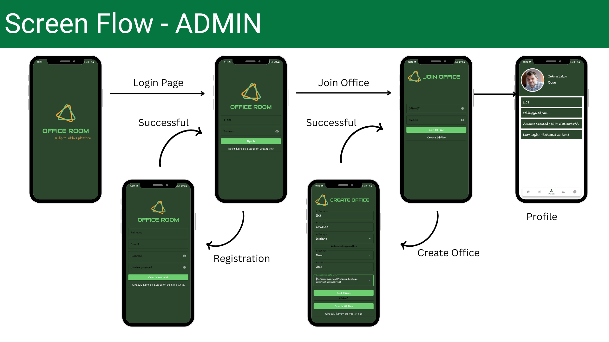
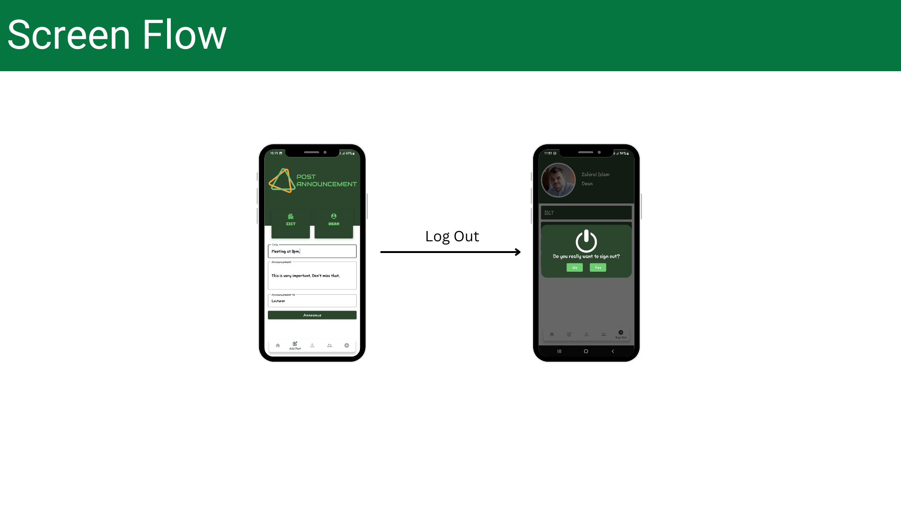
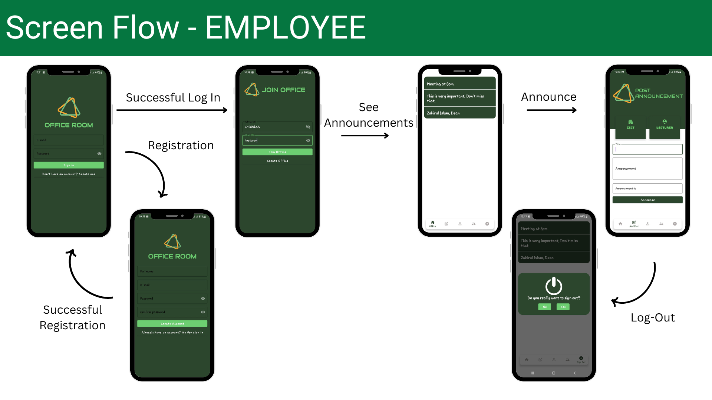

# Project Office Room
This is an android application that is built to provide a digital platform for office work such as notice publishing to a specific employer group, arrange meeting etc.    

## Screen Flow (Admin)

The first page is the login page. If the user doesn’t have an account, they can navigate to the registration page. After registering or logging in, the user can either join an existing office room or create a new one. Once inside the office room, all the main functionalities will be available.     

       

    

## Screen Flow (Employee)

After successfully logging in, the employee needs to join the office using their office ID and post ID. Once joined, they can view announcements from higher-ups and send notices to lower ranks. There is also an option to log out.        

